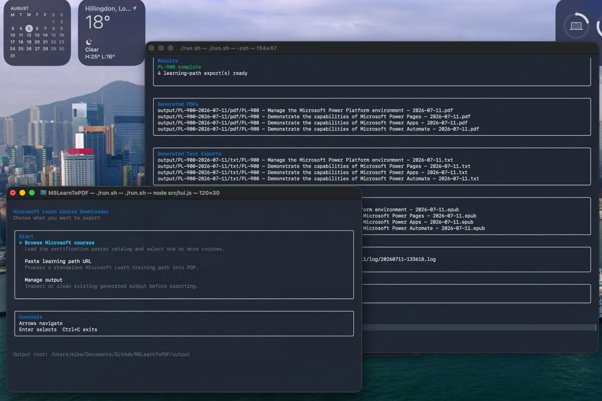

# Microsoft Learn to PDF

This project extracts public Microsoft Learn course content and produces
print-oriented study-book PDFs. It supports both a URL-driven CLI and a
colorful terminal UI that reads the official Microsoft certification poster and
lets you queue one or more courses for export.



## Launch the TUI

### Windows

```powershell
.\run.ps1
```

### macOS and Linux

```sh
git clone https://github.com/kramit/MSLearnToPDF.git
cd MSLearnToPDF
./run.sh
```

The launcher requires Node.js 22 or newer. On first use it installs JavaScript
dependencies and the Playwright Chromium build used for PDF generation. Both
Apple Silicon and Intel macOS are supported by the native canvas dependency.

If Node.js is not installed, the launcher can download a verified, repository-local
copy without administrator access:

```powershell
.\run.ps1 -InstallPrerequisites
```

```sh
./run.sh --install-prerequisites
```

The downloaded runtime is stored under `.tools/` and is used automatically by
future runs. On macOS and Linux, put `--install-prerequisites` before other options.

Optional alternate app config:

```powershell
.\run.ps1 -Config .\config\app.json
```

```sh
./run.sh --config ./config/app.json
```

The TUI:

- refreshes the official certification poster with cached fallback
- shows every recognized course code from the poster
- supports search, multi-select, and queue review
- can launch a full poster-wide QA sweep with `Q`
- displays live conversion progress and verbose logs
- writes outputs under the configured output root

Default app config lives in `config/app.json`.

## Convert a Microsoft Learn URL

```powershell
npm install --no-package-lock
npm run install:browser
npm run convert -- --url "https://learn.microsoft.com/en-us/credentials/certifications/exams/ai-901/"
```

Verify that the local browser can produce a PDF:

```sh
npm run smoke:pdf
```

Force a fresh Microsoft Learn snapshot:

```powershell
npm run convert -- --url "https://learn.microsoft.com/..." --refresh
```

If a direct learning-path URL does not identify its course unambiguously:

```powershell
npm run convert -- --url "https://learn.microsoft.com/en-us/training/paths/..." --course-code "AI-901"
```

The converter creates dated folders such as:

- `output/AI-901-2026-06-20/pdf/`
- `output/AI-901-2026-06-20/html/`
- `output/AI-901-2026-06-20/txt/`
- `output/AI-901-2026-06-20/epub/`
- `output/AI-901-2026-06-20/log/`

Each PDF, EPUB, and text-only LLM export is named from the same learning-path base:

- `AI-901 - <Learning Path title> - 2026-06-20.pdf`
- `AI-901 - <Learning Path title> - 2026-06-20.txt`
- `AI-901 - <Learning Path title> - 2026-06-20.epub`

The text export is a compact plain-text artifact for LLM chat/context ingestion.
It keeps course, learning-path, module, unit, URL, assessment, and reviewed
answer-key landmarks while stripping print-oriented layout.

The EPUB export is a compact Kindle-friendly EPUB 3 package. It keeps normal
lesson links but omits the separate source appendix, module assessment units,
and answer keys.

The log folder includes a course manifest with source resolution details,
learning-path order, counts, warnings, failures, filenames, and validation
results. Before a PDF is accepted, a reflection check confirms that its
learning-path UID, displayed title, report title, and filename all match the
course's expected learning path. A failed learning path does not prevent later
paths from being attempted, and a failed course in the TUI does not stop the
rest of the queue.

Source Markdown and images are cached under `cache/`. External labs, videos,
repositories, and documentation are retained as links but are not crawled.
Assessment questions are included; answer-key sections appear only when a
reviewed answer file is configured.

## Run a QA conversion audit

For one or more explicit URLs:

```powershell
npm run qa -- --url "https://learn.microsoft.com/en-us/credentials/certifications/exams/ai-901/"
```

For a larger unattended sweep driven from the certification poster catalog:

```powershell
npm run qa -- --all-poster --poster-refresh --refresh
```

The QA runner:

- resolves each course URL
- runs the normal download and PDF conversion pipeline
- re-checks every exported learning path against Microsoft Learn hierarchy data
- validates the generated PDFs for required text, source order, and blank pages
- writes a consolidated QA report

QA outputs are written to:

- `output/qa-<RUN-ID>/log/qa-summary.json`
- `output/qa-<RUN-ID>/log/qa-summary.md`

Each course entry in the QA report includes:

- resolved learning-path count
- passed and failed learning paths
- exported module and unit totals
- assessment-question totals
- embedded and missing image counts
- external-resource counts
- per-learning-path PDF and report paths
- per-learning-path EPUB and text paths when present
- detailed issues for missing modules, missing units, title drift, reflection failures, and PDF validation failures

The QA command exits with a nonzero code if any course is partial or failed, so
Codex or another LLM can use it as a reliable gate in an automated review flow.

## Repeatable SC-500 configuration builds

The existing configuration workflow remains available:

```powershell
npm run build
npm run build:refresh
npm run build:path
```

The underlying CLI accepts `--config <path>` with optional `--refresh`.

## PDF validation

URL exports are validated automatically for module/unit presence, source order,
blank pages, and expected answer-key content. To render a PDF for visual review:

```powershell
node src/render-pdf.js "<pdf-path>" "<output-directory>"
```

This is a study aid and dated snapshot of Microsoft Learn content, not an
automatically current replacement for the source course.
